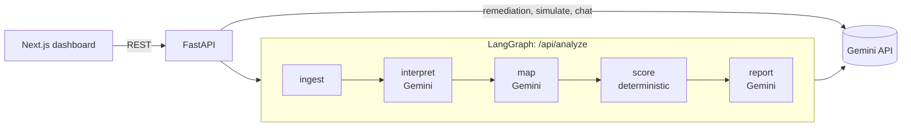

<div align="center">

# ComplyAI

**AI-assisted compliance analysis: Gemini interprets regulations, deterministic code scores the risk.**


</div>

## Overview

ComplyAI takes a regulation and a company's existing controls, extracts the regulatory obligations, assesses each one against those controls, and produces gaps, scores, an audit-style report, remediation plans and what-if simulations. It is a FastAPI + LangGraph backend with a Next.js dashboard.

**Key technical point:** Google Gemini handles *interpretation and explanation* (extracting rules, judging coverage, writing the report), while **risk and compliance scores are calculated deterministically** in plain Python from severity weights and assessment statuses. Scores are reproducible and auditable, not model opinions.

## Demo


https://github.com/user-attachments/assets/8cfce0b3-8e52-40a6-a4ba-43238d18ce7a


## Key Features

- **Rule extraction:** splits regulation text into atomic obligations with a category and severity.
- **Gap analysis:** one verdict per rule, with evidence and affected policies.
- **Deterministic scoring:** risk score, risk level and compliance score computed by code, not the LLM.
- **Audit report:** executive summary, business impact, risk explanation, priorities and an indicative fine range in INR.
- **Remediation:** policy draft, checklist and action steps for a selected gap.
- **What-if simulator:** assess a hypothetical regulation and see the risk change against your baseline gaps.
- **Chat:** answers grounded in the gaps and scores from your latest analysis.
- **Structured LLM output:** Gemini responses are constrained to a JSON schema and validated with Pydantic, with one retry on invalid output.

## Architecture



Risk is `100 · (1 − Π(1 − w_severity · f_status))`, with severity weights critical 0.40 / high 0.25 / medium 0.12 / low 0.05, and partial or unknown findings counting half. Levels: below 25 LOW, below 50 MEDIUM, below 75 HIGH, otherwise CRITICAL. See `backend/app/scoring.py`.

## Tech Stack

| Layer | Technologies |
|---|---|
| Backend | Python, FastAPI, LangGraph, Pydantic v2 |
| LLM | Google Gemini via the `google-genai` SDK (`gemini-3.8-flash` by default) |
| Frontend | Next.js 16, React 19, TypeScript, Tailwind CSS 4 |
| Testing | pytest, ESLint, TypeScript |

## Main API Endpoints

| Endpoint | Description |
|---|---|
| `POST /api/analyze` | Full pipeline: rules, assessments, gaps, scores, report, fine estimate |
| `POST /api/remediation` | Policy draft, checklist and actions for one gap |
| `POST /api/simulate` | Hypothetical regulation assessed and layered on baseline gaps |
| `POST /api/chat` | Chat grounded in the supplied analysis context |
| `GET /health` | Config status (`llm_configured`, `model`, `provider`); does not call Gemini |

## Setup

You need Python 3.12+, Node.js 20+ and a [Gemini API key](https://aistudio.google.com/apikey).

```bash
# Backend
cd backend
python -m venv .venv && source .venv/bin/activate   # Windows: .venv\Scripts\activate
pip install -r requirements-dev.txt
cp .env.example .env                                 # set GEMINI_API_KEY (GEMINI_MODEL optional)
uvicorn app.main:app --reload --port 8000

# Frontend (new terminal)
cd frontend
cp .env.example .env.local                           # NEXT_PUBLIC_API_URL=http://localhost:8000
npm install
npm run dev                                          # http://localhost:3000
```

## Testing

```bash
cd backend && pytest
cd frontend && npx tsc --noEmit && npm run lint && npm run build
```

Pipeline tests use a scripted fake LLM; the Gemini client tests stub only the HTTP transport, so the suite runs offline without a key. The running application makes real Gemini calls.

## Project Structure

```
ComplyAI/
├── backend/
│   ├── app/
│   │   ├── main.py       # FastAPI routes and error handlers
│   │   ├── workflow.py   # LangGraph graph
│   │   ├── pipeline.py   # extraction, assessment, gaps, fines
│   │   ├── scoring.py    # deterministic scores
│   │   ├── services.py   # remediation, simulation, chat
│   │   ├── llm.py        # Gemini client
│   │   ├── prompts.py    # prompts
│   │   ├── schemas.py    # API and LLM output schemas
│   │   └── config.py     # settings from .env
│   └── tests/
└── frontend/
    ├── app/              # Next.js app shell
    ├── components/       # Dashboard, Findings, Workflow, Compliance, Simulator, Chat
    └── lib/              # typed API client and types
```


